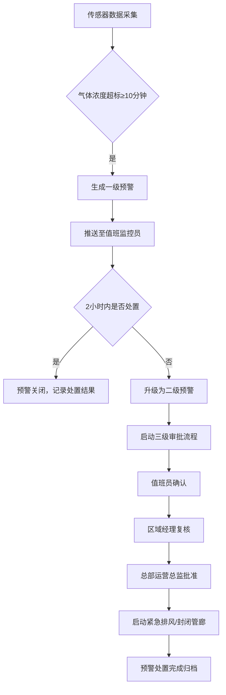
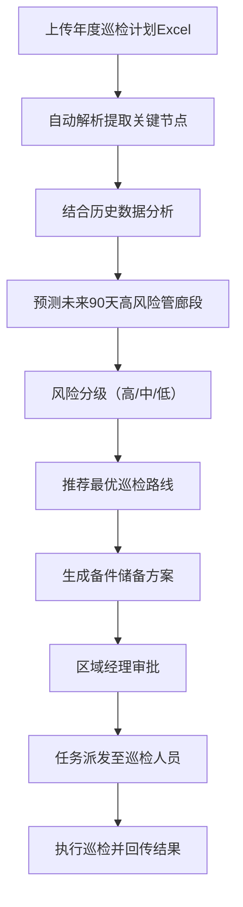

## 1. 产品概述

全国性地下综合管廊运营与安全监测分析平台，面向国家、省、市三级管廊运营管理部门，实时接入全国各管廊段传感器数据，实现健康状态监测、智能预警、风险预测、巡检管理和运营诊断的全流程数字化管理。

- 主要目标：解决地下管廊运营安全风险不可控、运维效率低、应急响应慢的问题
- 目标用户：总部运营总监、区域经理、城市值班监控员、巡检维修人员
- 市场价值：保障城市地下生命线安全运行，提升管廊运维智能化水平，降低安全事故发生率

## 2. 核心功能

### 2.1 用户角色

| 角色 | 注册方式 | 核心权限 |
|------|----------|----------|
| 总部运营总监 | 系统分配 | 全国管廊数据查看、二级预警最终审批、运营报告查看、策略审批 |
| 区域经理 | 系统分配 | 所辖省份管廊数据查看、预警复核、维修排期审批、巡检计划管理 |
| 城市值班监控员 | 系统分配 | 所辖城市管廊实时监控、一级预警处置、设备状态管理、报修申请 |
| 巡检维修人员 | 系统分配 | 巡检任务接收、维修记录上传、备件领用登记 |

### 2.2 功能模块

1. **实时监控看板**：全国管廊健康热力图、核心指标概览、故障率排名、实时预警列表
2. **管廊段详情**：传感器近7天趋势曲线、设备状态列表、维修时间线、历史预警记录
3. **预警管理中心**：一级/二级预警列表、预警处置流程、三级审批工作流、紧急措施执行
4. **巡检计划管理**：年度巡检计划Excel上传、关键节点自动提取、高风险管廊预测、巡检路线推荐、备件储备方案
5. **权限与层级管理**：国家/省/市三级数据权限控制、用户角色管理、操作审计日志
6. **运营健康诊断报告**：周度自动报告生成、健康指数同比环比、故障原因分布、维护及时率分析、优化策略推荐

### 2.3 页面详情

| 页面名称 | 模块名称 | 功能描述 |
|----------|----------|----------|
| 登录页 | 身份认证 | 账号密码登录、角色识别、验证码校验 |
| 总览看板 | 健康热力图 | 中国地图按省份显示管廊健康状态热力分布，支持点击下钻到城市 |
| 总览看板 | 核心指标卡 | 全国管廊总数、在线率、平均健康指数、设备可用率、当前预警数 |
| 总览看板 | 故障率排名 | 按城市/管廊段展示故障率TOP10排行榜 |
| 总览看板 | 实时预警流 | 滚动展示最新预警信息，支持快速处置入口 |
| 管廊详情 | 传感器趋势 | 温湿度、气体浓度等多维度近7天折线图，支持区间缩放 |
| 管廊详情 | 设备状态面板 | 照明、风机、排水泵等设备实时状态列表 |
| 管廊详情 | 维修时间线 | 按时间轴展示该管廊段所有维修、巡检、预警事件 |
| 预警中心 | 预警工作台 | 按等级、状态分类的预警列表，支持筛选、搜索、批量操作 |
| 预警中心 | 审批流程 | 三级审批状态追踪、审批意见填写、紧急措施执行确认 |
| 巡检管理 | 计划上传 | Excel模板下载、文件上传、数据预览与校验 |
| 巡检管理 | 风险预测 | 未来90天高风险管廊段列表、风险等级标注、预测依据说明 |
| 巡检管理 | 路线推荐 | 最优巡检路线可视化、备件清单推荐、任务派发 |
| 运营报告 | 诊断报告 | 周度报告列表、报告详情查看、PDF导出、趋势对比图表 |
| 系统管理 | 权限管理 | 用户、角色、三级层级数据权限配置 |

## 3. 核心流程

### 3.1 预警处置流程

值班监控员登录系统后，在实时看板查看当前预警。当某管廊段气体浓度连续10分钟超标，系统自动生成一级预警并推送至值班监控员。值班监控员收到预警后，需在2小时内完成处置确认。若2小时内未处置，系统自动升级为二级预警并启动三级审批流程：值班员确认→区域经理复核→总部运营总监批准。审批通过后系统自动启动紧急排风或封闭管廊措施。

### 3.2 巡检计划管理流程

用户上传年度巡检计划Excel，系统自动解析提取关键巡检节点。结合历史故障数据、传感器趋势、设备老化情况，系统预测未来90天高风险管廊段并分级标注。基于风险等级、地理位置、人员配置，自动推荐最优巡检路线和备件储备方案，经区域经理审批后派发至巡检人员执行。

## 4. 用户界面设计

### 4.1 设计风格

- 主色调：深蓝(#0F172A) + 科技青(#06B6D4)，营造专业工业监控氛围
- 辅助色：预警红(#EF4444)、警告黄(#F59E0B)、正常绿(#10B981)
- 按钮风格：直角硬朗边缘，轻微发光描边，强调工业感
- 字体：标题使用"Space Grotesk"粗体，数据展示使用"JetBrains Mono"等宽字体，正文使用"Noto Sans SC"
- 布局风格：深色仪表盘式布局，分栏卡片模块化，大量使用数据可视化组件
- 图标风格：Lucide线性图标，统一2px线宽

### 4.2 页面设计概览

| 页面名称 | 模块名称 | UI元素 |
|----------|----------|---------|
| 总览看板 | 健康热力图 | 深色中国地图背景、热力点发光动画、悬浮数据卡片、城市/管廊下钻交互 |
| 总览看板 | 核心指标卡 | 渐变发光边框、实时数据脉冲动画、环比增减箭头、图标数字组合 |
| 总览看板 | 故障率排名 | 横向柱状图进度条、排名徽章、颜色渐变从绿到红、点击跳转详情 |
| 总览看板 | 实时预警流 | 时间轴式滚动列表、等级色彩标识、闪烁告警动效、快速处置按钮 |
| 管廊详情 | 传感器趋势 | ECharts多系列折线图、区域缩放控件、阈值参考线、悬浮数据tooltip |
| 管廊详情 | 设备状态面板 | 栅格布局设备卡片、状态指示灯动画、在线/离线/故障三色状态 |
| 管廊详情 | 维修时间线 | 垂直时间轴、事件类型图标、时间节点连线、展开详情面板 |
| 预警中心 | 预警工作台 | 数据表格、筛选条件栏、批量操作工具栏、行内快捷操作 |
| 预警中心 | 审批流程 | 步骤条组件、审批状态节点、审批意见输入框、文件附件区域 |
| 巡检管理 | 风险预测 | 卡片式风险列表、风险等级徽章、预测置信度进度条、风险因素标签 |
| 巡检管理 | 路线推荐 | 地图路线可视化、站点列表顺序、距离/时长估算、拖拽调整顺序 |
| 运营报告 | 诊断报告 | 报告卡片网格、周期间对比图表、关键指标highlight、PDF导出按钮 |

### 4.3 响应式

- 桌面端优先设计，最小支持1366×768分辨率
- 关键监控看板支持2K/4K大屏展示，数据可视化自适应缩放
- 侧边栏可折叠，内容区域流式布局
- 表格支持横向滚动，移动端优先展示核心数据列

### 4.4 数据可视化指导

- 热力图使用echarts geo组件，叠加散点图展示管廊位置和健康状态
- 趋势图使用echarts line组件，支持dataZoom区域缩放和markLine阈值标注
- 排名使用横向条形图，进度条末端显示具体数值
- 所有图表使用深色主题，grid分割线采用低透明度灰色
- 数据变化时使用平滑过渡动画（duration: 800ms, easing: cubicOut）
