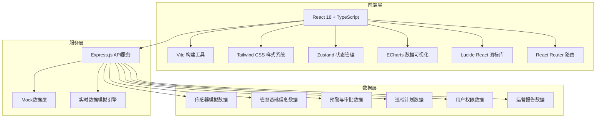
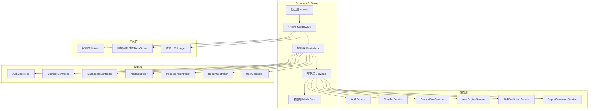
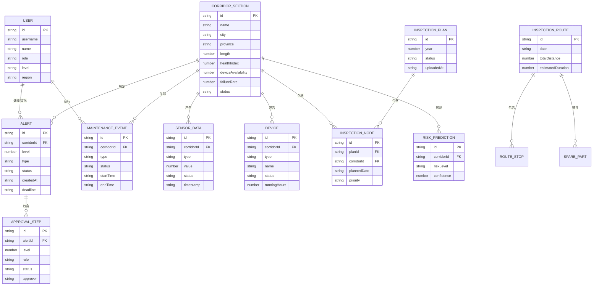

## 1. 架构设计



## 2. 技术说明

- 前端：React@18 + TypeScript + Vite@5 + Tailwind CSS@3 + Zustand@4
- 路由：react-router-dom@6
- 数据可视化：echarts@5 + echarts-for-react
- 图标：lucide-react
- HTTP请求：axios
- 后端：Express@4（提供Mock数据API服务）
- 数据存储：内存Mock数据（前端演示用），文件持久化
- 初始化工具：vite-init（react-express-ts模板）

## 3. 路由定义

| 路由 | 页面用途 | 权限级别 |
|-------|---------|----------|
| /login | 登录页 | 公开 |
| /dashboard | 总览监控看板 | 全部角色 |
| /corridor/:id | 管廊段详情页 | 全部角色（数据权限过滤） |
| /alerts | 预警管理中心 | 值班监控员及以上 |
| /alerts/:id | 预警详情与审批流程 | 对应审批角色 |
| /inspection | 巡检计划管理 | 区域经理及以上 |
| /inspection/risk | 高风险预测与路线推荐 | 区域经理及以上 |
| /reports | 运营健康诊断报告 | 全部角色 |
| /reports/:id | 报告详情页 | 全部角色 |
| /system/users | 用户权限管理 | 总部运营总监 |

## 4. API 定义

### 4.1 TypeScript 类型定义

```typescript
// 管廊段信息
interface CorridorSection {
  id: string;
  name: string;
  city: string;
  province: string;
  length: number;
  constructionYear: number;
  status: 'online' | 'offline' | 'maintenance';
  healthIndex: number;
  deviceAvailability: number;
  failureRate: number;
  coordinates: { lng: number; lat: number };
}

// 传感器数据
interface SensorData {
  id: string;
  corridorId: string;
  type: 'temperature' | 'humidity' | 'gas_ch4' | 'gas_co' | 'gas_h2s' | 'oxygen';
  value: number;
  unit: string;
  threshold: { warning: number; danger: number };
  timestamp: string;
  status: 'normal' | 'warning' | 'danger';
}

// 传感器历史趋势
interface SensorTrendPoint {
  timestamp: string;
  value: number;
}

// 设备信息
interface Device {
  id: string;
  corridorId: string;
  type: 'lighting' | 'fan' | 'pump' | 'door' | 'camera';
  name: string;
  status: 'online' | 'offline' | 'fault';
  lastMaintenance: string;
  runningHours: number;
}

// 预警信息
interface Alert {
  id: string;
  corridorId: string;
  corridorName: string;
  level: 1 | 2;
  type: 'gas_exceed' | 'device_low_availability' | 'other';
  title: string;
  description: string;
  sensorType?: string;
  thresholdValue?: number;
  actualValue?: number;
  durationMinutes?: number;
  status: 'pending' | 'processing' | 'approved' | 'rejected' | 'closed' | 'escalated';
  createdAt: string;
  deadline: string;
  approvalFlow?: ApprovalStep[];
  handler?: string;
}

// 审批步骤
interface ApprovalStep {
  id: string;
  level: 1 | 2 | 3;
  role: 'duty_officer' | 'regional_manager' | 'hq_director';
  approver?: string;
  status: 'pending' | 'approved' | 'rejected';
  comment?: string;
  approvedAt?: string;
  requiredAction?: 'ventilation' | 'seal' | 'inspection';
}

// 维修事件
interface MaintenanceEvent {
  id: string;
  corridorId: string;
  type: 'repair' | 'inspection' | 'alert_response' | 'preventive';
  title: string;
  description: string;
  deviceId?: string;
  deviceName?: string;
  personnel: string[];
  startTime: string;
  endTime?: string;
  status: 'planned' | 'in_progress' | 'completed';
  result?: string;
}

// 巡检计划
interface InspectionPlan {
  id: string;
  year: number;
  uploadedAt: string;
  uploadedBy: string;
  status: 'draft' | 'approved' | 'published';
  nodes: InspectionNode[];
}

interface InspectionNode {
  id: string;
  corridorId: string;
  corridorName: string;
  plannedDate: string;
  inspector?: string;
  priority: 'high' | 'medium' | 'low';
}

// 风险预测
interface RiskPrediction {
  corridorId: string;
  corridorName: string;
  city: string;
  riskLevel: 'high' | 'medium' | 'low';
  confidence: number;
  predictionWindow: string;
  riskFactors: string[];
  historicalFailures: number;
  lastInspection: string;
}

// 巡检路线
interface InspectionRoute {
  id: string;
  name: string;
  date: string;
  corridorCount: number;
  totalDistance: number;
  estimatedDuration: number;
  stops: RouteStop[];
  spareParts: SparePart[];
}

interface RouteStop {
  corridorId: string;
  corridorName: string;
  address: string;
  order: number;
  estimatedArrival: string;
  tasks: string[];
}

interface SparePart {
  id: string;
  name: string;
  quantity: number;
  unit: string;
  forCorridors: string[];
}

// 运营报告
interface OperationReport {
  id: string;
  weekNumber: number;
  year: number;
  startDate: string;
  endDate: string;
  generatedAt: string;
  summary: {
    avgHealthIndex: number;
    healthIndexYoY: number;
    healthIndexWoW: number;
    totalAlerts: number;
    avgDeviceAvailability: number;
    maintenanceTimelyRate: number;
  };
  failureDistribution: { category: string; count: number; percentage: number }[];
  trendComparison: { week: string; healthIndex: number; failureRate: number }[];
  recommendations: string[];
}

// 用户信息
interface User {
  id: string;
  username: string;
  name: string;
  role: 'hq_director' | 'regional_manager' | 'duty_officer' | 'inspector';
  level: 'national' | 'provincial' | 'municipal';
  region?: string;
  province?: string;
  city?: string;
  avatar?: string;
}
```

### 4.2 API 接口列表

| 方法 | 路径 | 说明 |
|------|------|------|
| POST | /api/auth/login | 用户登录 |
| GET | /api/auth/me | 获取当前用户信息 |
| GET | /api/corridors | 获取管廊段列表（按权限过滤） |
| GET | /api/corridors/:id | 获取管廊段详情 |
| GET | /api/corridors/:id/sensors | 获取管廊段实时传感器数据 |
| GET | /api/corridors/:id/sensors/trend | 获取传感器近7天趋势数据 |
| GET | /api/corridors/:id/devices | 获取管廊段设备列表 |
| GET | /api/corridors/:id/maintenance | 获取管廊段维修时间线 |
| GET | /api/dashboard/summary | 获取看板核心指标 |
| GET | /api/dashboard/heatmap | 获取热力图数据 |
| GET | /api/dashboard/failure-ranking | 获取故障率排名 |
| GET | /api/alerts | 获取预警列表 |
| GET | /api/alerts/:id | 获取预警详情 |
| POST | /api/alerts/:id/handle | 处置一级预警 |
| POST | /api/alerts/:id/approve | 审批预警（各级审批） |
| GET | /api/inspection/plans | 获取巡检计划列表 |
| POST | /api/inspection/plans/upload | 上传巡检计划Excel |
| GET | /api/inspection/risk-predictions | 获取高风险预测列表 |
| GET | /api/inspection/routes | 获取推荐巡检路线 |
| GET | /api/reports | 获取报告列表 |
| GET | /api/reports/:id | 获取报告详情 |
| GET | /api/system/users | 获取用户列表（仅总部） |

## 5. 服务端架构图



## 6. 数据模型

### 6.1 ER 图



### 6.2 前端目录结构

```
src/
├── components/           # 通用组件
│   ├── layout/          # 布局组件
│   │   ├── AppLayout.tsx
│   │   ├── Sidebar.tsx
│   │   ├── Header.tsx
│   │   └── Breadcrumb.tsx
│   ├── charts/          # 图表组件
│   │   ├── HealthHeatmap.tsx
│   │   ├── SensorTrendChart.tsx
│   │   ├── FailureRankingChart.tsx
│   │   └── ReportComparisonChart.tsx
│   ├── dashboard/       # 看板组件
│   │   ├── StatCard.tsx
│   │   ├── AlertFeed.tsx
│   │   └── MapLegend.tsx
│   ├── corridor/        # 管廊详情组件
│   │   ├── DevicePanel.tsx
│   │   ├── SensorGrid.tsx
│   │   └── MaintenanceTimeline.tsx
│   ├── alerts/          # 预警组件
│   │   ├── AlertTable.tsx
│   │   ├── AlertDetail.tsx
│   │   └── ApprovalFlow.tsx
│   ├── inspection/      # 巡检组件
│   │   ├── PlanUploader.tsx
│   │   ├── RiskPredictionList.tsx
│   │   └── RouteRecommendation.tsx
│   └── ui/              # 基础UI组件
│       ├── Button.tsx
│       ├── Badge.tsx
│       ├── Card.tsx
│       ├── Table.tsx
│       └── Modal.tsx
├── pages/               # 页面
│   ├── Login.tsx
│   ├── Dashboard.tsx
│   ├── CorridorDetail.tsx
│   ├── AlertsList.tsx
│   ├── AlertDetailPage.tsx
│   ├── InspectionManagement.tsx
│   ├── RiskPrediction.tsx
│   ├── ReportsList.tsx
│   ├── ReportDetail.tsx
│   └── UserManagement.tsx
├── store/               # Zustand状态管理
│   ├── useAuthStore.ts
│   ├── useCorridorStore.ts
│   ├── useAlertStore.ts
│   └── useUIStore.ts
├── hooks/               # 自定义hooks
│   ├── useApi.ts
│   ├── useRealtime.ts
│   └── usePermission.ts
├── services/            # API服务
│   ├── api.ts           # axios实例
│   ├── auth.service.ts
│   ├── corridor.service.ts
│   ├── alert.service.ts
│   ├── inspection.service.ts
│   └── report.service.ts
├── types/               # TypeScript类型
│   └── index.ts
├── utils/               # 工具函数
│   ├── format.ts        # 格式化工具
│   ├── permission.ts    # 权限工具
│   └── constants.ts     # 常量配置
├── styles/              # 全局样式
│   └── globals.css
├── App.tsx
├── main.tsx
└── vite-env.d.ts
```
